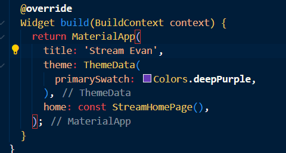
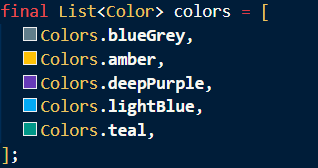
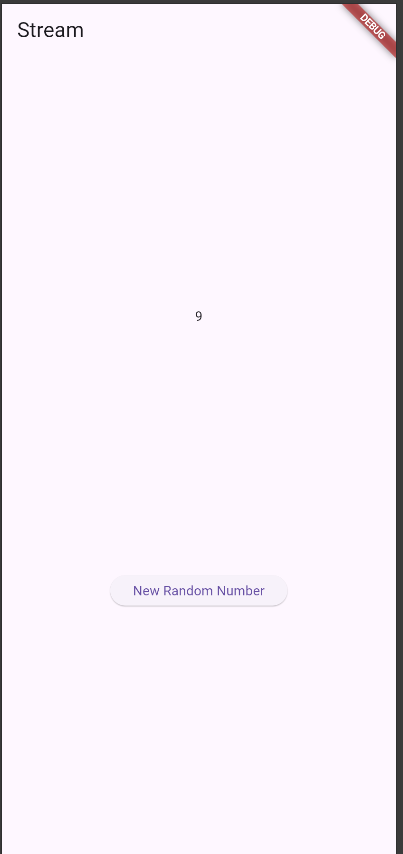

# stream_evan

A new Flutter project.

## Praktikum 1
**Soal 1**

**Soal 2**

**Soal 3**

yield* colors adalah inti fungsinya. Perintah ini mengambil seluruh elemen dari daftar colors (yang berisi Colors.blueGrey, Colors.amber, dll.) dan secara otomatis mengirimkan setiap elemen tersebut satu per satu sebagai bagian dari stream yang dikembalikan.

**Soal 4**

<video controls src="20251112-0656-24.0037006.mp4" title="Title"></video>

**Soal 5**

await for (Langkah 9) membutuhkan pembungkusan fungsi (changeColor harus async) dan dipanggil dari initState().

.listen() (Kode Alternatif) lebih ringkas jika Anda langsung memasukkannya ke initState(), dan merupakan praktik terbaik jika Anda berencana menangani pembatalan langganan di dispose().

## Praktikum 2
**Soal 6**

Setiap kali fungsi ini dipanggil (yaitu, setiap kali pengguna menekan tombol), fungsi ini menghasilkan angka acak dan memicu stream untuk mengeluarkan angka tersebut. Karena widget sudah mendengarkan (listen) stream ini (Langkah 8), UI akan langsung diperbarui.

**Soal 7**

Langkah ini mengubah fungsionalitas tombol dari "tambah angka" menjadi "tambahkan kesalahan" untuk tujuan pengujian. Ketika tombol ditekan, Stream akan mengeluarkan error, yang kemudian akan ditangkap oleh .onError() (Langkah 14), dan lastNumber di UI akan berubah menjadi -1.

## Praktikum 3
**Soal 8**
<video controls src="20251112-1554-42.0427728.mp4" title="Title"></video>

